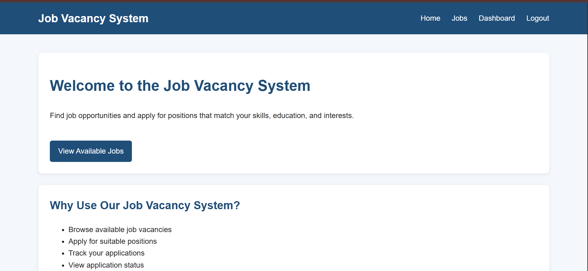
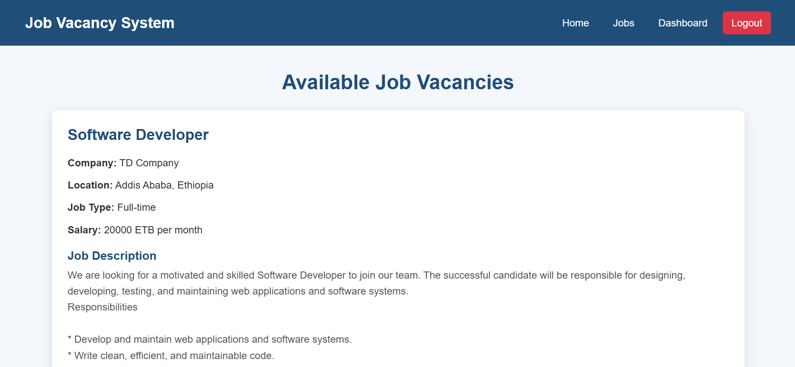
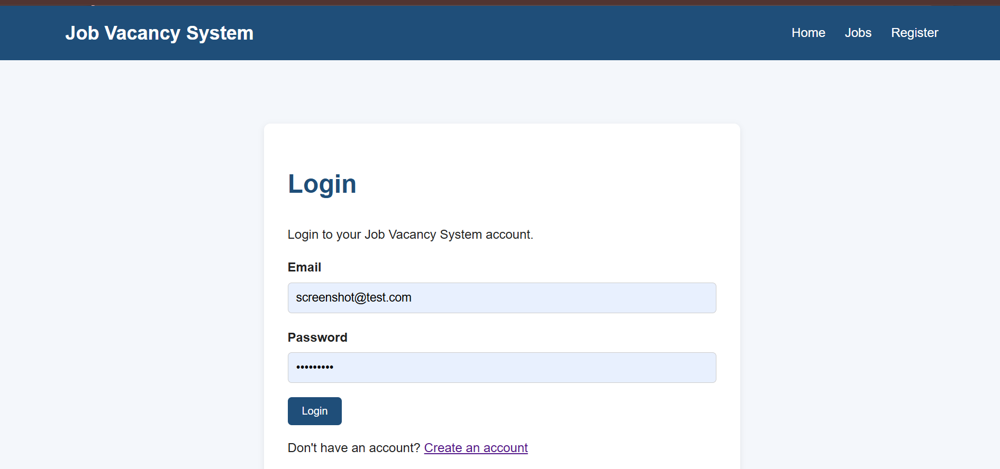
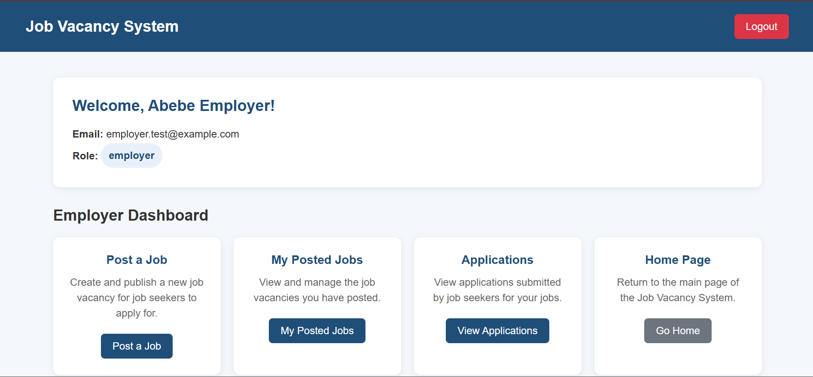
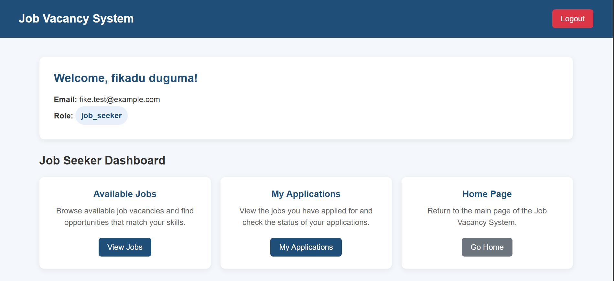
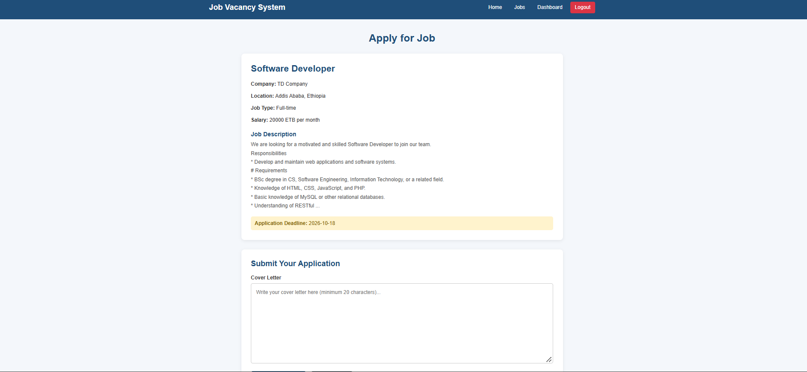

# Job Vacancy System

A web-based job vacancy management system built with PHP and MySQL.
Allows employers to post jobs and job seekers to apply for them.

## ✨ Features

- User registration and login (employers & job seekers)
- Employers can post, manage, and delete job vacancies
- Job seekers can browse jobs, apply, and track applications
- Employers can review applications and accept/reject candidates
- Secure authentication with password hashing

## 🛠️ Technologies Used

- **Backend:** PHP (PDO)
- **Database:** MySQL
- **Frontend:** HTML, CSS, JavaScript
- **Server:** XAMPP (Apache + MySQL)

## 📋 Requirements

- PHP 7.4 or higher
- MySQL 5.7 or higher
- Apache server (XAMPP, WAMP, or LAMP)

## 🚀 Installation

1. **Clone the repository**
   ```bash
   git clone https://github.com/TamiruAdugna/job-vacancy-system.git
   ```

2. **Move to your web server directory**
   - XAMPP: `C:\xampp\htdocs\job-vacancy-system`

3. **Create the database**
   - Open phpMyAdmin (`http://localhost/phpmyadmin`)
   - Create a database named `job_vacancy_system`
   - Import the `schema.sql` file from the `database/` folder

4. **Configure the app**
   - Copy `config.sample.php` to `config.php`
   - Edit `config.php` with your DB credentials:
     ```php
     $host     = "localhost";
     $dbname   = "job_vacancy_system";
     $username = "root";
     $password = "";
     ```

5. **Run the app**
   - Open `http://localhost/job-vacancy-system/`

## 🔑 Test Accounts

Register a new account to test the app.

**To test as an employer:**
1. Register normally on `register.php`
2. In phpMyAdmin, run:
   ```sql
   UPDATE users SET role = 'employer' WHERE email = 'your-test-email';
   ```
3. Log out and log back in.

**Default role for new registrations:** job seeker

## 📸 Screenshots

### Homepage


### Job Listings


### Login


### Employer Dashboard


### Job Seeker Dashboard


### Apply for a Job


## 📁 Project Structure

```
job-vacancy-system/
├── assets/                    # CSS, JS, images
├── database/                  # SQL schema
├── screenshots/               # Project screenshots
├── .gitignore
├── config.sample.php          # Config template
├── index.php                  # Homepage
├── login.php                  # Login page
├── register.php               # Registration page
├── logout.php                 # Logout handler
├── dashboard.php              # Role-based dashboard
├── view_jobs.php              # Job listings (public)
├── apply.php                  # Apply to a job (job seeker)
├── my_applications.php        # My applications (job seeker)
├── post_job.php               # Post job form (employer)
├── save_job.php               # Save job handler (employer)
├── my_jobs.php                # My posted jobs (employer)
├── applications.php           # Review applications (employer)
└── README.md
```

## 🤝 Contributing

Pull requests are welcome. For major changes, please open an issue first.

## 📄 License

This project is licensed under the MIT License.

## 👤 Author

**Tamiru Adugna**
- GitHub: [@TamiruAdugna](https://github.com/TamiruAdugna)
- Email: tamiruadugna73@gmail.com